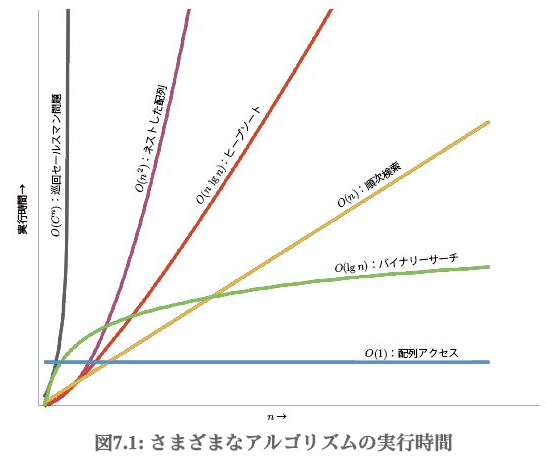

# 第7章  コーディング段階

## 概要

## 37  爬虫類脳からの声に耳を傾ける
**爬虫類脳 = 暗黙知・本能**
プログラマーとして経験を積み重ねることで、暗黙知（上手くいくこと・いかないことの判別）が蓄積される。
暗黙知が警鐘を鳴らしている、そのサインを見極めることが重要。コードをなかなか書き進められないときは、何かを間違えている可能性が大きい。
* 構造や設計が間違っている
* 誤った問題を解決しようとしている

自らの暗黙知との対話ステップ。
1. 作業を止め、キーボードから離れて他のことをする。
2. 問題を具体的な形に表現し、他者に説明してみる。
3. **プロトタイピング**などにより、状況を整理して不安を消す。

### プロトタイピング
既存のコードを相手に作業し、手こずっている場合は、似たようなもののプロトタイピングを行うことで考えを整理できる。プロトタイピングは以下のように始める。
1. ポストイットに"プロトタイピング中"と描いて画面の横に貼る。
2. **プロトタイピングは失敗するために行う**という意識を持ち、プロトタイプはいずれの場合でも捨て去る。
3. 実行したいこと・やりたいことをコメントとして1行にまとめる。
4. コーディングを始める。

コーディングの最中にぼんやりした不安が具体化したら、その問題に取り組む。
プロトタイピングが終了し、それでも不安が残るのなら、しばらくコーディングから離れて散歩。

### コードから学ぶ
他人のコードを読むことで、他人の”本能”（意思決定）を知ることができる。見知らぬ方法で実装されている箇所を見つけたらそれをメモする習慣を持ち、そこからパターンを見つけ出し、パターンの根拠を明らかにすることができれば、コードへの理解は一気に深まる。

## 38  偶発的プログラミング
**行き当たりばったりの偶発的なプログラミングではなく、慎重なプログラミングを行う。**
少しでも触ると動かなくなるのになぜか動いているコード、動いているように見えるコードが存在している。それでもコードに手を加えなければならないときは来てしまう。
* 動いているようで動いていない
* 前提の境界条件が偶発的で、異なる解像度やCPUでは動かない
* 次のアップデートでドキュメント化されていない動作が必要
* 不要な呼び出しが残っているので挙動が重い

他人の使うコードを書いているなら、**正しいモジュール化**の基本原則と**コンパクトかつ上手にドキュメント化されたインターフェイスの背後に実装を隠す**という基本原則に準じ、契約（DbC）を活用することも有用。
機能を呼び出すときは**ドキュメント化されている振る舞いのみ**を前提とする。

タイムゾーンが1時間ずれるから、+1して出力すればOKという偶発的対処は問題。基本的な欠陥は別。
欠陥は”ユーザーが日本語を話す”・”ディレクトリが書き込み可能”といったコンテキストが間違っている可能性もある。

要求確定からテストに至るまで、暗黙の仮定からなる偶然が蔓延している。そのような仮定はドキュメント化されず、開発者間で矛盾する場合もあり、有害である。

### 慎重なプログラミング
* 常に何をしているかを意識する
* コードの詳細を新人に説明できるか
* 完全に理解していない手法や馴染みのない技法を使わない
* 明確なプランが頭の中にあるか
* 信頼のおけるものごとのみを前提とする
* 仮定をドキュメント化する（DbC）
* コードのテストのみではなく、仮定のテストも行う（表明を使用）
* 作業に優先順位をつけ、重要な部分に時間を掛ける
* 既存コードのしがらみにとらわれない

## 39  アルゴリズムのスピード
**プロジェクト終了までの時間的見積もり以外に、プログラマーはアルゴリズムの時間消費やメモリなどのリソースの見積もりを行っている。**

O記法を使って計算量を評価する。

ソートアルゴリズム自体を開発することはほぼないが、使用する機会が多いので計算量を意識することは非常に役立つ。
  

コードの実行時間やメモリ使用量の目安がわからない場合は、影響する数値を変更した結果をグラフで可視化して確認すればイメージがつくようになる。
常に現実的な視点でアルゴリズムを選択する。

## 40  リファクタリング
**ソフトウェアは建築よりもむしろガーデニング。**
常に状態を監視しながら、すこしずつ変えていくもの。建築のように科学的・繰り返し可能・指示報告が厳格というものではない。

Martin Fowlerのリファクタリング（リファクタリング  第2版：読んでる途中で忘れてたｗ）の定義。
* このアクティビティーは規律あるものであり、勝手気ままにすすめるものではない。
* 外部から見た振る舞いを変えることは許されていない。リファクタリングは機能追加をする場所ではない。

### リファクタリングを行うべきタイミング
* 二重化しているものを発見したとき
* 直行していない設計があるとき
* 時代遅れの知識が出てきたとき
* ユーザーによる使用方法が変わったとき
* パフォーマンス向上が必要なとき
* テストが通っているとき

リファクタリングをするべき箇所を放置しておくと、あとで大量の時間投資が必要になる。他の部分を巻き添えにして被害が拡大する。不十分なコードを**腫瘍**と捉え、早めにこまめにリファクタリングを行うべし。

### リファクタリングの方法
* リファクタリングと機能追加を同時に行わない
* リファクタリングの前にテストを追加し、頻繁にテストを行う。
* メソッド分割や変数リネームなど小さな単位で少しずつ行う。

## 41  コードのためのテスト

