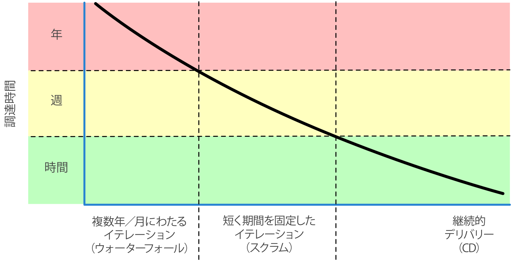

# 達人のプロジェクト

## 49 達人のチーム

> Tip84 小規模で安定したチームを作ること

- 割れた窓をなくす
  - チーム全体で品質を担保する
- 蛙の煮物
  - 全員がチーム内の状況(スコープ位の増大、追加機能、見積もり残時間の減少)を把握・監視する
- 知識ポートフォリオの充実に向けて計画する
  - チーム全体の知識・スキルの工場に向けた投資計画
  - > Tip85 事を成し遂げるにはまずスケジュールする
- 伝達しよう
  - チーム内で情報交換が闊達に行われる
    - ミーティング内の準備の行き届いた説明
    - 簡潔かつ正確で一貫性を持った資料
    - チーム内の意見のまとまり
- DRY原則
  - 即時的かつスムージなコミュニケーションによりメンバー間の二重化を防ぐ
- チームにおける曳光弾
  - 小さな単位での迅速な機能実装、顧客の要求への達成度・フィードバックの取得
  - チームの動き・作業の容易な変更/高度化
  - > Tip86 完璧に機能するチームを編成すること
- 自動化
  - 整合性と正確性を確実にする
- 絵画制作のやめ時を知る
  - メンバー自身の方法で能力を発揮できるようにする

## 50 ココナツでは解決できない

見た目を真似しても、本質を理解して利用しなければ意味がない

### コンテキストが重要となる

> Tip 87 流行を追いかけるのではなく、効き目があるものごとを実行すること

小規模なチーム・複数のチームでアイディアを実行し、効き目のあるもの以外は切り捨てる。

### どんな状況にも適用できる万能の方策など存在しない

ソフトウェア開発方法論の目的：人々が力を合わせて働けるように支援する
必要なものは、あらゆる方法論の良いところを抜き出して、利用できるように適合させる能力

### 真のゴール

> Tip 88 ユーザーが必要としたタイミングで調達すること



## 51 達人のスターターキット

作業の自動化で基本かつ重要な3つの要素

- バージョン管理
  - > Tip 89 バージョン管理によってビルド／テスト／リリースを駆動すること
- 回帰テスト
  - > Tip 90 早めにテスト、何度もテスト、自動でテスト
  - > Tip 91 テストがすべて終わるまでコーディングは終わらない
  - > Tip 92 テストのテストをするには破壊工作を試みる
  - > Tip 93 コードのカバレージではなく、状態のカバレージをテストすること

      ``` C
        int test(int a, int b) {
          return a / (a + b);
        }
      ```

  - > Tip 94 同種のバグを一度に見つけること
- 完全な自動化
  - > Tip 95 手作業を排除する

## 52 ユーザーを喜ばせる

開発者としての目標：**ユーザーを喜ばせる**こと
→ 手元にある業務上の問題を解決

> Tip 96 単にコードを調達するのではなく、ユーザーを喜ばせる

## 53 自負と偏見

> Tip 97 あなたの作品に署名すること

黄金律（他人にやってもらいたいことを、まず他人に施せ）と開発者間で相互に尊重し合うことがこのティップスを機能させる上で必要不可欠なもの
